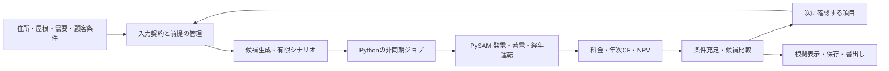

# [Epic] TRACE PoC：PySAM計算基盤と条件からの設備提案・次の確認支援

GitHub公開済み: [#1](https://github.com/romashito-ueda/enegaeru_biz_poc/issues/1)

## 結論と目的

既存TRACE PoCを起点に、PySAMへ物理計算を移し、その上に「顧客条件から設備案を逆算する」「判断に影響する次の確認項目を選ぶ」を実装する。対象は産業用太陽光・蓄電池を提案する販売施工店/EPCの営業・技術担当者。

住所入力から、屋根確認、顧客条件の設定、最大3案の比較、追加確認による再評価、根拠付きの保存・書出しまでを一つの案件内で完結させる。数値の物理的整合、入力の少なさ、再提案のしやすさを検証する。競合の非公開エンジンより精度が高いと実証した計画ではない。

## 今回の範囲

- データは合成fixture・固定値・機器プリセットでよい。モック/推定/確認済みと出典・対象期間を残す。
- 契約電力、基本料金削減、実量制、ピークカットを目的とした最適化は対象外。
- AC接続、PVと蓄電池の自家消費優先、自己所有・税前・借入なし、20年評価を基本とする。
- 蓄電池の系統充電は初期PoCでは無効。旧設定は黙って変えず確認対象にする。
- 使用電力がない段階では発電ポテンシャルまで。削減額・自家消費率は需要の入力/仮定を示した後に計算する。
- 実APIの調達・費用・カバレッジ検証はF02へ分離し、初期PoCの依存先にしない。
- 境界探索はF01へ分離。LLM、成約予測、REopt/Julia、本番認証・課金・共同編集は必須にしない。

## 現状と開始点

2026-09-15確認。登録先 `romashito-ueda/enegaeru_biz_poc` は空で既存Issueなし。ユーザー指定によりここへ登録する。別リポジトリの旧計画は変更しない。

ローカルにはReact 19/Vinext/npm構成のTRACE PoCがある（基準コミット `98223fe`）。住所は現在文字列の保存のみ。計算は `lib/simulation.ts` の同期処理で、比較案は固定プリセット。localStorage/JSON、CSV入力、Excel/提案書出力を備える。アプリ本体のPySAM接続と独自探索は未実装。

研究ではPySAM 8.0.0で30分PV、電池20年、交換とSOC等を合成入力で確認した。PV長期劣化とPCS制限、詳細PV+電池の長期統合等は未検証。記録上の単発電池20年計算は約13.3秒で、候補を大量に評価する実装を無制限に走らせない。T00でコード・研究・本計画を取り込み、以後はその基準から進める。

## 構成

ブラウザ/Workers内でPython・SSCを直接動かさず、ローカルPythonサービスへ分離する。標準エンジンと決定ロジックの境界を保ち、外部データproviderを差し替えても計算・推奨契約を維持する。

## 実装順序と完了ゲート

| 段階 | Issue | その段階で確認できること |
| --- | --- | --- |
| M0 開始点 | T00 | 新checkoutから既存UIと調査を再現できる |
| M1 計算接続 | T01 → T02 → T03 | 共通JSONから非同期API経由でPV発電量が返る |
| M2 公平な経済評価 | T04 → T05 → T06 | 20年PV+電池・費用をUIへ返し、旧結果と新条件を混同しない |
| M3 提案支援 | T07、T08 → T09 → T10 | 住所から候補比較、次の確認、再提案、書出しまで通る |
| M4 受入 | T11 | 独立した数値検証・探索検証・ブラウザ検証・処理時間の記録が揃う |
| 後続 | F01、F02 | 成立境界の探索、実住所・屋根・気象データへの接続 |

依存は各Issueを正とする。T07の画面設計はT01後、T06の非同期状態設計はT02後に着手できるが、完了判定には各Issueの依存先が必要。表の順序は作業日程の約束ではない。

## 差別化ロジックの仕様

### 設備案の逆算

離散的な設備候補を列挙し、屋根/PCS/出力/費用の整合を満たすものを同じ20年モデルで評価する。予算・回収条件をhard constraintsとして、初期費用・NPV等の目的と分ける。目的に応じた非劣解を最大3案返す。

需要減少などの明示したシナリオで、全条件を満たす案と条件付きの案を分ける。候補なし、導入なし、蓄電池なしも妥当な結果として返す。探索集合・評価件数・打切りを保存し、評価した範囲を超える最適性や成功確率を主張しない。

### 次の確認項目

未確定情報に回答候補と取得手間を持たせ、回答ごとの候補評価の変化を求める。最初は「条件充足が変わる → 推奨が変わる → 候補間NPV差の変動幅 → 取得手間」の辞書順で説明可能にする。確率的な情報価値や学習済みの営業判断と称さない。

例えば、休日の日中需要で推奨容量が変わる時に、その確認を先に提示する。回答/不明/取消で前提を更新し、確認済み項目の再質問や無関係な必須入力を避ける。

## 計算上の共通ルール

- 通常年30分17,520区間、JST、区間開始時刻。アプリのkWhとPySAMのkWを明示変換する。うるう年は初期PoCで拒否し、入力から黙って日を削除しない。
- 1時間データの30分変換は元解像度を保存し、30分実測として扱わない。
- 絶対AC発電CSVは設備に固定し、同じ波形のまま容量/PCSを変えて比較しない。
- PV劣化は物理出力に反映してPCS制限・自家消費・電池運転を再評価する。削減額へ劣化率を直接掛けない。
- 電池寿命・交換・期首/期末残量・電力由来を追い、年次費用と同じ交換イベントを使う。
- 追加NPVは売電減収と維持更新費を含む。PV/PCS kW、電池kWh/PCS kW、工事費を区別する。
- 予算の既定は補助前初期支出。回収制約は非割引CFが評価末まで再び負にならない持続回収を用い、初回黒字化やNPVと区別する。
- 保存・画面・帳票は同一のinput/result hashを参照する。

## 性能と検証

元モデルの1回約13秒という観測から、全探索を商談中に瞬時に完了できるとは仮定しない。候補の事前除外、共通PV系列と結果のキャッシュ、計算上限、進捗/取消、古い結果の識別を初期実装に含める。

暫定の基準ケースは最大6構成×3シナリオ・20年、UI操作応答200ms目標、最初の評価済み候補60秒、全体300秒。T11で基準PC・入力・cold/warmを記録し検証する。未達なら評価計画を改善し、探索範囲を変えた場合は明示する。これは現時点で達成済みの性能ではない。

検証は、(1)短い独立手計算・保存則、(2)PySAM接続と年次一貫性、(3)小規模全列挙による候補/質問の正しさ、(4)住所から書出しまでの操作、を分ける。合成データで動くことと実測精度・実顧客の業務効果は別に記録する。

## 完了条件

- [ ] T00〜T11が完了し、コード・実行手順・検証結果がこのリポジトリから辿れる。
- [ ] 外部データAPIキーなしで、住所fixtureから屋根確認・条件入力・比較・質問回答・保存・書出しが動く。
- [ ] モック/未確定/確認済み、計算対象外、探索完了/打切りが表示と出力に残る。
- [ ] 電力量保存、SOC、劣化/PCS、交換、CF、追加NPV、CSV整合性を独立ケースで検証できる。
- [ ] 条件に合う案なし、電池なし、質問不要、回答で推奨変更、を扱える。
- [ ] 時間上限・失敗・取消・応答競合で、誤った最新結果を確定表示しない。
- [ ] F01/F02が未完了でも初期PoCを完成と判定できる。

## 子Issue

- [ ] [T00](T00.md) — 既存PoCを取り込み、開発・検証の開始点を揃える（M0 / P0 / S）
- [ ] [T01](T01.md) — 入出力契約・前提条件・時系列と検証用データを定義する（M1 / P0 / M）
- [ ] [T02](T02.md) — Python計算サービスと非同期ジョブの実行基盤を作る（M1 / P0 / M）
- [ ] [T03](T03.md) — 太陽光の方位・傾斜・PCS・経年計算をPySAMへ移す（M1 / P0 / L）
- [ ] [T04](T04.md) — 蓄電池・20年運転・電力由来と残量の整合を実装する（M2 / P0 / L）
- [ ] [T05](T05.md) — 年次収支・追加NPV・費用条件を共通評価へ接続する（M2 / P0 / M）
- [ ] [T06](T06.md) — UIを非同期計算へ切り替え、保存データと結果の版を管理する（M2 / P0 / M）
- [ ] [T07](T07.md) — 住所から屋根確認・発電ポテンシャルへ進む導線を作る（M1→M3 / P1 / M）
- [ ] [T08](T08.md) — 顧客条件から設備候補を探索し、条件に強い案を選ぶ（M3 / P1 / L）
- [ ] [T09](T09.md) — 推奨案に影響する次の確認項目を選び、回答で再評価する（M3 / P1 / L）
- [ ] [T10](T10.md) — 候補比較・推奨理由・次の確認を一つの提案画面に統合する（M3 / P1 / M）
- [ ] [T11](T11.md) — 計算・提案・質問の受入検証と処理時間を記録する（M4 / P0 / M）
- [ ] [F01](F01.md) — 条件が成立する境界と最小限の条件変更を示す（後続 / P2 / M）
- [ ] [F02](F02.md) — 住所・屋根・気象の実データ取得を検証して接続する（後続 / P2 / L）

## 代替案と後続判断

- 連続空間や大規模な候補探索が必要になったら、REopt等で候補を生成しPySAMで再評価する構成を再検討する。初期は有限列挙で再現性を優先する。
- 実データの取得が難しい地点は手入力と前提表示を維持し、対応地点だけ実providerを使う。
- 多拠点の投資配分、税/融資/PPA、系統充電/価格裁定、契約電力、商用基盤は今回の完了条件に追加しない。

## 参照資料

T00で取り込む `research/calculation-logic-audit.md`、`research/calculation-package-assessment.md`、`research/engine-evaluation/`。これらには2026-09-08時点の出典と再現手順がある。版の採用はその検証を出発点とし、実装時に更新する場合は差異を再検証する。

<!-- trace-plan:2026-09-15:E01 -->
