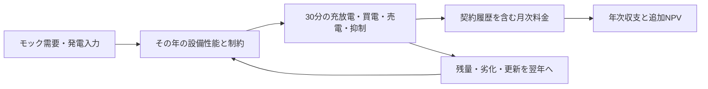

# TRACE 計算ロジック調査

調査日：2026年9月8日／対象：`98223fe` の計算・比較ロジック。

**結論：現状は操作を検証するPoCとして成立していますが、実データを入れるだけでは導入判断に使える計算にはなりません。** 電力収支と割引現在価値の基本式は維持できます。一方、契約電力、夜間の放電分岐、経年計算、発電CSVと設備容量の対応は、計算構造の修正が必要です。

料金・気象・設備係数・劣化率は引き続きモックで構いません。先に「同じ入力なら説明可能な結果になる計算」を確立する方針を推奨します。データ入手可能性・価格・ライセンスは今回調べていません。

## 調査の範囲と判定

東京電力エナジーパートナーの公開料金説明、SAM、PVWatts、pvlib、GHG Protocolの一次資料と実装を照合しました。SAMの全仕様を唯一の正解とは扱わず、日本の料金制度、計算の物理的整合性、比較目的に応じて判定しています。確認した公開資料へのリンクは各論点に付けています。

以下は**改修提案に対する判定**です。「採用」は修正仕様への取り込みを推奨する意味で、実装済みという意味ではありません。P1は導入効果・案比較に使う前に修正、P2は対象モデルの明示または拡張が必要、という優先度です。

| ID | 改修提案 | 判定 | 優先度 | 主な影響 |
| --- | --- | --- | --- | --- |
| F1 | 契約電力を月ごとの履歴から決定する | 採用 | P1 | 初年度の基本料金削減を先取りする |
| F2 | 夜間充電の許可と、ピーク超過時の放電を分離する | 採用 | P1 | 放電可能なのにピーク削減を逃す |
| F3 | 各年の発電・蓄電運転・料金を再計算する | 採用 | P1 | 20年利益、NPV、回収年数が歪む |
| F4 | 方位・傾斜を物理モデルへ置き換える | 一部採用 | P2 | 発電モックは許容。屋根設計の比較には現式を使えない |
| F5 | 蓄電池の追加価値を売電減収込みで評価する | 一部採用 | P2 | 「電気代だけの回収」は算式どおりだが、経済性の結論には不足 |
| F6 | CSVが表す設備条件を案比較に反映する | 採用 | P1 | 同一発電量に異なる設備費・PCS制約を対応させてしまう |

6件とも、コードを確認したうえで合成入力による再現を行いました。F4・F5を含め、すべてを単純なプログラムのバグと判定しているわけではありません。

## F1：年間最大値をすべての月に使っている

対象：[料金集計](../lib/simulation.ts#L358)。現行の実量相当モードは、当該年の最大買電電力を算出して12か月すべての基本料金に使います。

東京電力の実量制の説明では、当月と直前11か月の最大需要電力から契約電力を決定します。使用開始時の扱いも別です。また、同社の説明では500 kW以上は協議で決めるため、実量制をすべての案件へ適用することはできません。[実量制の決定方法](https://www.tepco.co.jp/ep/corporate/charge_c2/decision03.html)、[契約区分](https://www4.tepco.co.jp/ep/corporate/charge_c/decision01.html)

**再現結果**：標準案件を1月に導入し、導入前12か月のピークを標準案件の「設備なし」の月別ピークと同じに設定。協議による契約変更はなく、他の単価・計算条件は維持しました。

| 指標 | 現行計算 | 履歴を使う初年度計算 |
| --- | ---: | ---: |
| 基本料金の年間削減 | 265,356円 | 110,565円 |
| 電気料金の年間削減合計 | 9,191,825円 | 9,037,034円 |

この条件では初年度の削減額を**154,791円、約15.5万円多く**計上します。過去の426.04 kWが7月まで残り、8月から414.08 kWへ下がるためです。これは仮定した履歴についての差額であり、実顧客の請求額ではありません。

修正仕様は、設備なし／設備ありでそれぞれ月次履歴を持ち、`契約kW[m] = max(月次ピーク[m-11 ... m])` とすることです。既存需要家への設備導入と、新規の電気使用開始を区別します。契約値の丸め、最小値、協議変更、力率等は選択した料金モデル側で処理します。

なお、同じ負荷・設備状態が前年から毎年完全に繰り返される定常状態では、年間最大値による簡略化と一致する場合があります。したがって式を全面的に誤りとはせず、現行は「定常年の簡易試算」としてのみ残せます。初年度の投資回収計算へ流用するのが問題です。

## F2：夜間充電を許可すると放電できない時間帯が生じる

対象：[充放電の分岐](../lib/simulation.ts#L302)、[画面の運転説明](../components/conditions.tsx#L384)。

0〜6時に `gridCharge=true` なら充電分岐に入り、充電量がゼロでも放電分岐へ進みません。画面はピーク優先時に目標超過分を放電すると説明しているため、挙動が説明と一致しません。SAMでも系統充電の許可と運転目的を別に扱い、目標追従では電力と目標を比較して充放電を決めます。[SAMの蓄電池運転](https://samrepo.nlr.gov/help/battery_dispatch_btm.html)

**再現結果**：1月1日1時、需要300 kW、目標100 kW、充放電出力100 kW、直前の利用可能残量95.92 kWh。

| 指標 | 現行 | 同じ残量・出力制約で可能な運転 |
| --- | ---: | ---: |
| 30分間の放電量 | 0 kWh | 50 kWh |
| 買電電力 | 300 kW | 200 kW |

100 kWの目標までは出力不足で届きませんが、200 kWへ下げることは可能です。目標未達そのものではなく、**可能な放電が分岐で抑止されること**を問題としています。

修正は、ピーク優先で不足電力が目標を超える場合に放電を判定し、その後に余力・残量・許可時間から系統充電を判定することです。充電専用時間として放電を禁止する仕様を選ぶ場合は、別の明示的な制約にします。

自家消費優先、固定目標追従、料金最小化は別の目的です。現行ルールを「最適制御」と呼ぶことはできませんが、説明可能なルール運転として残すことは妥当です。料金最小化を追加する際は、売買単価、需要料金、翌日の発電、劣化コストを目的関数に含め、完全予測を使った参考上限と、予測誤差を含む運転を区別します。これは追加設計の提案です。

## F3：劣化を発電量ではなく削減額へ直接掛けている

対象：[20年キャッシュフロー](../lib/simulation.ts#L395)。

現在は初年度の料金削減全体に、料金上昇率と劣化率を掛けています。発電・蓄電運転は初年度しか計算していません。そのため、太陽光の劣化を、基本料金削減や蓄電池単独の効果にも一律に適用します。電池容量の劣化と更新後の容量回復もありません。

SAMのPV＋蓄電池モデルでは、劣化を発電性能へ反映して評価期間をシミュレーションし、蓄電池の劣化をPVの劣化と区別します。固定スケジュールによる交換も選べます。[発電の経年計算](https://samrepo.nlr.gov/help/degradation.html)、[蓄電池の寿命・交換](https://samrepo.nlr.gov/help/battery_life.html)

**再現結果**：毎日1区間だけ需要10 kWh、太陽光30 kWh。電池・売電・基本料金・維持更新費・料金上昇はゼロ、PV劣化だけ年5%の複利に設定しました。年5%は挙動検証用で、実設備の推奨値ではありません。

| 指標 | 結果 |
| --- | ---: |
| 初年度の料金削減 | 96,725円 |
| 20年目の同一区間の発電量 | 11.32 kWh |
| 現行式による20年目の効果 | 36,500円 |
| 劣化した発電量から再計算した20年目の効果 | 96,725円 |

20年目も発電量が需要を上回るので、削減額は減りません。現行式は**60,225円過小評価**します。別の条件ではピーク削減を過大評価する可能性もあり、一定の補正係数では直せません。

推奨仕様は、毎年、PV劣化→必要ならPCSでの出力制限→電池容量・効率・更新反映→30分運転→月次料金→キャッシュフローの順に再計算することです。需要波形や気象の同一年繰り返し、一定の劣化率・単価は引き続き使えます。料金上昇は従量・基本・燃調等の対象成分へ適用し、設備劣化と混ぜません。

PV劣化を線形にするか複利にするかは、モデルの仕様として明示します。SAMにも両方の扱いがあり、複利そのものを誤りとは判定していません。重要なのは適用先と再計算です。

## F4：方位・傾斜による時間帯の変化がない

対象：[発電波形・補正](../lib/simulation.ts#L194)。現在は合成の日射波形に方位の絶対値と傾斜の倍率を掛けています。

PVWattsは方位・傾斜・位置・DC/AC容量比等を入力とし、pvlibは位置、面の向き、日射、温度、DCからACへの変換をモデルとして分離しています。[PVWatts V8](https://developer.nlr.gov/docs/solar/pvwatts/v8/)、[pvlib ModelChain](https://pvlib-python.readthedocs.io/en/stable/user_guide/modeling_topics/modelchain.html)

再現では、東向きと西向きの17,520区間が完全に一致しました。朝だけ需要がある場合でも料金削減は同じです。また、**傾斜0度の水平面で方位だけを変えると発電量が18%減ります**。水平面は方位を変えても受光面の向きが変わらず、これは物理的な方位モデルとして成立しません。遮蔽等を別途入力していない現行条件での指摘です。

ただし、ユーザーが許容している発電データのモックとして波形を残すこと自体は問題ありません。採用範囲は「屋根条件から発電を求める計算を提供するなら、物理モデルへ置き換える」です。モック波形を使う期間は、方位・傾斜の設計効果を評価済みと扱わない設計にします。

後続では固定の場所・気象・温度係数でも、太陽位置→傾斜面日射→温度補正DC出力→インバーター変換・出力制限をつなげられます。時刻・単位の整合も必要で、例えばPVWattsの時間別AC出力はWです。毎時出力を機械的に半分ずつ配るだけでは、30分最大需要電力の精度を検証したことにはなりません。

## F5：追加投資の説明に売電減収が入っていない

対象：[蓄電池の追加回収年数](../components/workspace.tsx#L1201)。計算は `追加投資 / 追加の電気料金削減` です。表示にも「削減額だけ」「維持・更新費を除く」とあり、限定された指標としての算術誤りではありません。

ただし、電池に入れた電気を売れば得られた収入と、充放電損失を経済性に含める必要があります。NPVは利益と費用を評価期間全体で比較する指標です。[SAMのNPV](https://samrepo.nlr.gov/help/mtf_npv.html)

**再現結果**：毎日、昼に発電20 kWh、夕方に需要10 kWh。売電40円/kWh、夕方の買電26.5円/kWh、往復効率92%、電池40 kWh。維持更新費等はゼロです。売電単価は検証用モックで、契約条件の推奨ではありません。

| 電池なしからの変化 | 結果 |
| --- | ---: |
| 追加投資 | 2,400,000円 |
| 電気料金削減の増加 | ＋96,725円/年 |
| 売電収入の変化 | −159,929円/年 |
| 年間価値の差分 | **−63,204円/年** |
| 現行の追加回収表示 | 約24.8年 |

期首の利用可能残量ゼロ、期末残量29.57 kWhを金銭評価しない現行の境界条件を含む数値です。期末処理で厳密な差額は変わりますが、売電機会費用を含めると年間価値が負になるという結論は変わりません。

推奨は、追加価値を `Δ電気料金削減 + Δ売電収入 − Δ維持費 − Δ更新費` として年ごとに計算し、追加NPVを示すことです。買電のみの参考回収は補助指標にします。総額側のキャッシュフローは売電をすでに含むため、全体の計算で売電が丸ごと漏れているわけではありません。

## F6：発電CSVと設備条件が一致しない比較を作れる

対象：[CSVの優先読込](../lib/simulation.ts#L244)、[比較案の組み立て](../components/workspace.tsx#L122)、[詳細条件入力](../components/conditions.tsx#L346)。

`pvData` がある場合は、その区間の発電量を設備容量・PCSによらず使用します。絶対量のAC計測データをそのまま使う仕様は妥当です。しかし、比較案は同じCSVを引き継いでPV容量・PCSを変え、詳細入力でも容量を変更できます。メインの容量スライダーとWebMCPには防止処理があるものの、すべての変更経路には適用されていません。

再現では、同じCSVのままPVを100 kWと500 kWにすると、年間料金削減はどちらも8,780,580円、補助金控除後の投資は700万円と7,500万円になります。小さい案のPCSは85 kWなのに、入力AC発電には197.30 kWの区間もあり、設備条件と発電量が矛盾します。

推奨は次の2方式を分けることです。これは実装上の整合性から導いた設計提案です。

1. **設備に紐づく絶対量**：AC/DC、基準設備容量、PCS、時刻・区間を記録し、容量を変える比較を禁止するか、再生成を要求する。
2. **設備設計用の原単位波形**：基準を明記して容量に応じて変換する。PCS制限済みAC波形を単純拡大しても、DC/AC比変更時の失われたピークは復元できないため、適用範囲を限定する。

先に計算境界を確定すれば、ファイルの値はモックのままでも実装できます。

## 維持できる考え方と、追加する条件

| 論点・提案 | 判定 | 評価・必要な条件 |
| --- | --- | --- |
| 30分の電力量をkWhで持ち、平均電力をkWh÷0.5で求める | 採用 | 現行は整合。月間最大30分平均を求める基礎になる |
| 電池残量・充放電出力・同時充放電禁止を制約にする | 採用 | 現行の基本収支を維持。制御目的の正しさとは別に検証する |
| 往復効率を平方根に分けて充電・放電に適用する | 一部採用 | 損失を対称配分した集約モデルとして成立。唯一の物理モデルではない。AC側出力、電池内残量という境界を明記する |
| PV由来の放電のみを自家消費に含める | 採用 | 系統充電を再エネ自家消費として加算しない現行の由来追跡は維持できる |
| 一定の単価・燃調・賦課金を使う | 一部採用 | 架空の料金プランとして許容。月・季節・休日・時間帯に応じた料金関数は分離する |
| 電池変換効率や機器交換年を固定する | 採用 | 固定効率・固定交換スケジュールは既存モデルにもある。値の精密化は後続でよい |
| 高度な電気化学モデルと数理最適化をすぐ必須にする | 不採用 | 今回はルール運転、年ごとの容量低下、交換時の回復でも構造を検証できる。最適化は別の評価段階にする |
| 税・融資・PPA/FIPを直ちに全部実装する | 不採用 | 自己所有・税前・借入なしという対象を明示する。PPA等へ対応を広げる時点で契約当事者別の収支が必要 |

固定効率とAC/DC接続の区別は[SAMの電池システム](https://samrepo.nlr.gov/help/battery_storage_btm.html)、月次の料金内訳と設備有無の比較は[SAMの料金評価](https://samrepo.nlr.gov/help/utility_bill_results.html)に照らして確認しました。日本の時間帯・休日・調整額の適用は契約ごとに扱う必要があり、東京電力の現行公開プランにも複数の時間帯と例外日があります。[高圧・特別高圧プラン](https://www.tepco.co.jp/ep/corporate/plan_h/minaoshi_2025plan.html)

追加で仕様化すべき事項は以下です。いずれも変数の値を実データにする前に決められます。

- **接続方式と逆潮流［採用・P2］**：現行はAC側で独立したPVと電池をつなぐ集約モデルとして読むことができます。DC接続・共有PCSの出力制約とは区別します。売電単価ゼロは逆潮流禁止と同義ではありません。逆潮流上限を別変数にし、出力抑制量を売電量と分けます。[SAMの系統上限](https://samrepo.nlr.gov/help/grid_limits.html)
- **初期・期末残量［採用・P2］**：現行の残量ゼロは「非常用の確保分を除く利用可能残量」です。初期条件としては許容できますが、定常年・導入初年・20年間連続運転を区別し、年をまたぐ残量と最後の残量の扱いを統一します。非常用の確保割合だけで停電時の供給可能時間を評価したことにはなりません。
- **kWとkWhの設備費［一部採用・P2］**：現在の費用はPV kWと電池kWhだけに比例し、電池出力やPCS出力を変えても費用が変わりません。同じ一式設備の見積額としてなら許容できますが、出力も選べる比較では `電池kWh費 + 電池PCS kW費 + PV設備費 + 工事等固定費` のように対象を分けます。単価は固定モックで構いません。
- **補助金・更新費の対象［一部採用・P2］**：現行は各案に同じ補助金額を適用し、設備があれば12年目に同じ更新費を計上します。各案について利用者が置いた固定の見積額なら成立します。容量比較の自動生成では、対象設備・対象費目・上限・支給時期・交換対象を明示し、機器構成と連動させます。個別制度の適格性調査は今回の対象外です。
- **指標の意味［採用・P2］**：現行の自家消費率は「負荷へ届いたPV由来電力量÷PV発電量」で、蓄電損失を自家消費へ含めません。「1−売電量÷発電量」とは期末残量・損失等で異なります。定義を維持し、損失・売電・抑制・残量変化を別表示すると説明できます。
- **NPVと回収［一部採用・P2］**：`NPV = −初期投資 + Σ CF[y]/(1+r)^y` は妥当です。修正対象は主としてCFの生成側です。現行の初回の累積黒字化による回収は非割引指標として明示し、その後の更新費で再び累積赤字になり得るため、20年NPVと併記します。税前収支と割引率の名目／実質を揃えます。[回収指標](https://samrepo.nlr.gov/help/mtf_payback.html)
- **CO₂［一部採用・P2］**：現行は `買電減少量×一定係数` で、単位換算も整合します。「同一排出係数を仮定した購入電力由来排出量の差」として扱えます。証書・契約属性を含むScope 2算定、系統全体の回避排出量、製造を含むライフサイクル排出とは区別します。系統回避排出はScope 2総量と別に扱うという公式説明があります。[GHG Protocol](https://ghgprotocol.org/blog/inventory-and-project-accounting)

## 推奨する次の実装順序

**推奨案は、需要・発電のモック波形を維持したまま、料金と20年間の運転計算を作り直すことです。** 外部データ接続を前提にする必要はありません。

1. F2の分岐とF6の入力整合性を修正し、同じ条件から矛盾する案を作れないようにする。
2. F1の月次料金関数を切り出し、導入前履歴を含む設備有無の請求額を計算する。
3. F3の年次再計算を導入し、PV・電池の別々の劣化と交換・残量の継続を扱う。
4. F5の追加NPV、料金内訳、目標未達の時間と理由をUIに表示する。
5. 屋根の向きやPCS容量を設計する段階で、F4の発電供給元をPVWatts相当／pvlib等の物理モデルに置き換える。同じ固定気象入力で比較検証する。



各区間の保存則は維持します。出力抑制を追加するなら、抑制前の利用可能PVを左辺に置いた `PV + 買電 + 放電 = 負荷 + 充電 + 売電 + 抑制` と、`残量[t+1] = 残量[t] + 充電×充電効率 − 放電÷放電効率` を同時に検証します。初期残量、AC/DC境界、年をまたぐ時刻を入力契約に含めます。

UXでは、結果の数字を押すと「30分の電力収支→その月の料金→その年のCF」へたどれるようにします。比較案では、料金削減、売電増減、追加費用を同じ基準で並べ、目標未達は残量不足・出力不足・運転制約に分けて説明します。見た目だけでなく、**数値の理由と比較の公平さ**を体験上の強みにする提案です。

代替案は、物理モデルを先に導入してから料金・経年計算を接続する進め方です。屋根設計を最優先する場合には適しますが、現在確認した料金・収支の差異は別途修正が必要です。現行エンジンを維持して注意書きだけを増やす案は、操作デモの範囲なら可能ですが、今回求められた計算の妥当性には到達しません。

## 検証結果と再現方法

- 既存のシミュレーション8件とXLSX往復1件：**9件すべて成功**。
- 新規の診断：上記6論点の差異を再現。入力はすべて現行の入力検証関数を通過。
- 再現スクリプト：[calculation-audit.mjs](calculation-audit.mjs)
- 数値・監査対象ファイルのSHA-256：[calculation-audit-results.json](calculation-audit-results.json)

```sh
node research/calculation-audit.mjs
node --test tests/simulation.test.mjs tests/workbook.test.mjs
```

診断スクリプトのassertは、**現在の差異が再現したこと**を確認するものです。不具合を維持する回帰要件としてテストスイートへ入れてはいけません。修正時は、独立して計算した期待値・契約履歴の例・物理的に同等な条件を用いる受入テストへ置き換えます。

追加する受入条件は、夜間でも許可されたピーク追従が働くこと、過去ピークが正しい月に失効すること、PV劣化後も余剰なら自家消費削減額が維持されること、電池単独の効果をPV劣化で変えないこと、更新で電池容量が回復すること、期首・期末を含む収支が合うこと、CSVと設備条件が矛盾しないことです。物理モデルを導入する場合には、水平面の方位不変性、同じ固定気象・設備条件での参照モデル比較を加えます。

本調査で行ったのは公開仕様の照合、実装の確認、分析用ケースによる数値再現です。SAMとの全期間の直接ベンチマーク、実測データでの精度評価、競合の非公開エンジンとの比較は行っていません。**エネがえるBizを上回る計算精度が実証された段階ではありません。** アプリの計算・UI本体はこの調査では変更していません。
