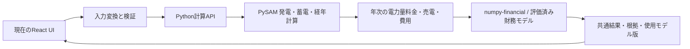

# 計算パッケージへの外出し検討

2026年9月8日。契約電力・実量制・基本料金削減は今回の検討対象外。

**結論：PySAMを計算コアに採用し、Pythonの計算サービスとして現在のUIから分離する構成を推奨します。** 太陽光発電、蓄電池運転、電池劣化・交換を既存エンジンへ任せられます。需要・気象・設備特性・単価はモックのまま開始できます。

候補を調べるだけでなく、この環境でPySAM 8.0.0を実行しました。30分の太陽光計算、20年の蓄電池計算、交換による容量回復、水平面の方位不変性、負荷収支を確認できました。ただし、現行アプリの置換や実測精度の検証はまだ行っていません。

## 候補の判定

「採用」は次の実装方針としての推奨です。アプリへ組み込み済みという意味ではありません。

| 候補 | 判定 | 任せる範囲 | 今回の判断 |
| --- | --- | --- | --- |
| **PySAM / SSC** | **採用** | PV、電池の充放電、SOC、寿命、交換、複数年の運転 | 計算コアの第一候補。SAMと同じSSCを利用でき、モデル定義・公開コード・リリース履歴を追える |
| **pvlib-python** | **一部採用** | 太陽位置、傾斜面日射、温度、PVのDC/AC変換 | PV部分を柔軟に組む代替候補。今回必要な電池・長期収支一式の置換を単独で担うものとしては選ばない |
| **numpy-financial** | **採用** | NPV、IRR、年金・融資の基本関数 | 財務の基本関数に利用。売買電・設備費・更新費から年次CFを組む部分は別途必要 |
| **PySAM Cashloan** | **一部採用** | 設備所有者のキャッシュフローと財務指標 | 外出し範囲を広げる候補。ただし米国の税・優遇措置等の設定を確認し、日本向け税前モデルへ対応づける検証が必要 |
| **REopt.jl** | **一部採用** | 設備容量・技術構成・運転の経済最適化 | 自動で最適容量を提案する段階の候補。今回の既定設備の計算置換はPySAMを先行する |

根拠：[PySAMとSSCの関係](https://sam.nlr.gov/software-development-kit-sdk/pysam.html)、[SAMのモデル構成一覧](https://nrel-pysam.readthedocs.io/en/main/sam-configurations.html)、[pvlibの対象モデル](https://pvlib-python.readthedocs.io/en/stable/user_guide/modeling_topics/modelchain.html)、[numpy-financial](https://numpy.org/numpy-financial/latest/)、[Cashloanの変数定義](https://nrel-pysam.readthedocs.io/en/main/modules/Cashloan.html)、[REopt.jl公式リポジトリ](https://github.com/NatLabRockies/REopt.jl)。

REoptはJuliaと最適化ソルバーを利用します。公式説明にはHiGHS等の利用例があります。最適化と、ある設備・制御条件でどう運転するかのシミュレーションは目的が異なるため、最初からすべてをREoptへ統一する必要はありません。

## PySAMを選ぶ理由

PySAMは、SAMの計算ライブラリSSCをPythonから呼び出す公式パッケージです。独自に作った簡易モデルの式を補修するより、公開されているモデルと入出力定義に沿って計算を任せる方が、今回の要求に適します。[公式SDK](https://sam.nrel.gov/software-development-kit-sdk.html)

2026年9月8日に確認した配布版は **`nlr-pysam==8.0.0`**。8.0.0以降は配布名が`nrel-pysam`から`nlr-pysam`へ変更されています。Pythonでのimport名は引き続き`PySAM`です。`pip install pysam`は別分野のパッケージを導入するため使いません。[公式インストール説明](https://nrel-pysam.readthedocs.io/en/main/installation.html)、[PyPIの配布情報](https://pypi.org/project/NLR-PySAM/)

PySAMのライセンスはBSD-3-Clause、pvlibもBSD-3-Clause、REopt.jlはApache-2.0です。いずれもソースとライセンスを確認できる選択肢です。組み込む配布物の表示条件は各LICENSEに従います。[PySAM LICENSE](https://github.com/NatLabRockies/pysam/blob/main/LICENSE)、[pvlib LICENSE](https://github.com/pvlib/pvlib-python/blob/main/LICENSE)、[REopt LICENSE](https://github.com/NatLabRockies/REopt.jl/blob/master/LICENSE)

「研究機関のモデルを使う」だけで計算全体の正しさが保証されるわけではありません。入力の境界、使用モード、版、単位、関連パラメータを揃えて初めて、モデルの信頼性を利用できます。公式資料にも、SAMの画面が更新している関連変数をPySAM利用側で整合させる必要があると説明されています。[関連変数の扱い](https://nrel-pysam.readthedocs.io/en/main/interdependent-variables.html)

## どこまで任せられるか

| 現行の処理 | 推奨する移管先 | UI側／接続部分に残る役割 |
| --- | --- | --- |
| 合成PV波形、方位・傾斜補正、PCS制限 | PySAM `Pvwattsv8`、詳細設計では`Pvsamv1` | モック気象を渡す。場所・向き・設備条件・時刻・単位を変換する |
| 余剰充電、買電、放電、残量 | PySAM `Battery`、または`Pvsamv1`内の電池モデル | 運転目的、接続方式、残量・出力制限を明示的に設定する |
| 電池劣化・交換 | PySAMの寿命計算・交換設定 | 電池モデル、固定の特性値、交換年・割合を入力する |
| 20年間の発電・運転 | lifetimeモードで年次の物理計算を行う | 全期間の結果から年次集計を作る。単価上昇を料金側へ適用する |
| 電力量料金・売電収入 | 当面は明示的な単価配列で集計。`Utilityrate5`も接続候補 | 円/kWhを各区間の買電・売電kWhへ適用する。契約電力由来の効果は含めない |
| 投資・維持更新費・補助金 | 明示的な年次CF、候補として`Cashloan` | 費目の対象・時期を設定する。金額の初期値はモックでよい |
| NPV・IRR | `numpy-financial`、または確認済みの財務モジュール | 初期投資を0年目へ入れ、同じ通貨・割引率基準で評価する |
| 自家消費率・自給率・CO₂・追加価値 | エンジン出力の集計 | 指標の分母、電池への電力の由来、比較基準、排出係数の意味を定義する |
| CSVの解釈・案比較 | アプリの入力契約と検証 | 絶対量の計測値と設備当たり原単位を区別し、比較案の設備条件と一致させる |

PySAMの公開構成には、`Pvwattsv8 → Battery → Grid → Utilityrate5 → Cashloan` の組み合わせもあります。すべての間の式を自作する必要はありません。ただし、モデルの組み合わせと今回の日本向けの入力条件を一致させる接続検証は残ります。[構成一覧](https://nrel-pysam.readthedocs.io/en/main/sam-configurations.html)

PVWattsは入力が少ないモデルとして適していますが、公式には詳細な劣化・損失評価が重要なら`Pvsamv1`を使用するよう案内されています。したがって、**最初の接続検証はPVWatts＋Battery、詳細設計・長期評価の本命はPvsamv1の適用検証**とするのが妥当です。[PVWattsモジュール仕様](https://nrel-pysam.readthedocs.io/en/main/modules/Pvwattsv8.html)

電池には自家消費、目標追従、手動運転、料金に応じた運転などがあり、年ごとに計算するモードや交換割合の指定もあります。実装では数値のモード番号をUIへ露出させず、意味を持つ設定に変換します。[Batteryモジュール仕様](https://nrel-pysam.readthedocs.io/en/main/modules/Battery.html)

**NPV関数だけを外出しする案は不採用です。** 前回指摘した「初年度の削減額に劣化率を掛けて20年へ延ばす問題」は、そのまま残るためです。毎年の運転結果を計算してから、買電・売電・費用をCFへ変換する順序を採用します。

## 今回行った実行検証

アプリの依存関係を変えず、作業用の`work/engine-packages`へパッケージを導入しました。Windows／Python 3.12.13での確認です。気象・負荷はすべてスクリプト内の合成値で、外部の気象APIは呼んでいません。

| 検証 | 結果 |
| --- | --- |
| PVWattsへ30分の合成気象を入力 | 17,520区間の結果を取得 |
| 水平面で方位のみ変更 | 発電の差は0 kW。前回の合成モデルの18%差は発生しない |
| 傾斜面で東西を変更 | 時刻別の波形が変化することを確認 |
| Batteryの20年連続計算 | 350,400区間の残量と運転結果を取得 |
| 電池の劣化 | 設定したモデルで、10年目末の容量比は約87.96% |
| 12年目の全量交換 | 容量比が約87.24%から100%へ回復 |
| 負荷への供給収支 | 最大誤差は約0.000005 kW。残量も指定上下限の数値許容差内 |
| Pvsamv1のPV部分 | 30分・1年の合成気象で実行成功 |
| numpy-financialのNPV | 手計算可能な定額年金の期待値と一致 |

これらの容量比は選んだ初期設定と合成運転に対する結果です。特定製品の寿命予測や推奨値ではありません。Battery検証はPVのAC波形を毎年同じにして電池側を評価しており、PVの長期劣化・PCS制限を検証済みとするものではありません。

最後に記録した単発計測はPVWatts約0.23秒、電池20年約13.3秒、Pvsamv1のPVのみ1年約3.5秒でした。先行の電池実行は約6秒で、実行環境の負荷等により変動しています。ネットワーク・並列実行を含む性能保証ではありません。

再現物：

- [実行スクリプト](engine-evaluation/smoke.py)
- [固定した依存バージョン](engine-evaluation/requirements.txt)
- [実行結果](engine-evaluation/results.json)

標準のPython環境では、独立した環境にrequirementsをインストールした後、`python research/engine-evaluation/smoke.py`で再現できます。このワークスペースの評価用パッケージを使う場合は`--dependency-dir work/engine-packages`を指定します。

残る検証は、詳細PV＋電池の複数年接続、PV劣化と出力制限、夜間充電・目標追従、料金／Cashloanへの日本向け入力対応、初期・期末残量、電力の由来を含む指標集計です。pvlibとREoptは資料で比較した段階で、今回実行していません。

## 現在のPoCへの組み込み方

PySAMはPythonとネイティブのSSCを使うため、Reactのブラウザ処理へ直接importする構成にはしません。**現行UI → 計算API → PySAM → 共通結果形式**という構成を推奨します。外部パッケージを自分たちの計算環境で動かす方式で、利用者の案件を第三者の計算SaaSへ送る必要はありません。

実装時は、以下の境界を固定します。

1. 入力を日付・タイムゾーン・区間長・AC/DC境界・単位付きにする。現行は区間kWh、PySAMの`gen`や電池の電力出力はkWなので、30分の場合は0.5時間で変換する。
2. 容量、PCS、セル構成等の関連値を、公式のサイジング関数と明示的な変換で揃える。今回の電池実行にも公式`BatteryTools`を使用した。
3. 戻り値にモデル名・版・入力識別子・計算対象を持たせる。契約電力／基本料金の効果は今回の対象に含めず、総料金削減と取り違えない表示にする。
4. 秒単位の計算に対応し、条件編集後に非同期実行する。古い結果には計算条件を示し、入力が変わった後の結果を最新として扱わない。入力単位のキャッシュと計算要求の整理で操作感を保つ。

料金の境界を分離しておけば、契約電力の評価は後から追加できます。今回、契約電力の制度調査や実装を進める必要はありません。

## 推奨案と代替案

**推奨：PySAMを中心に据え、まず外部エンジンの結果を現行グラフ・比較画面へ返す小さな接続を作る。** この段階では、実データ取得や最適容量探索を前提にしません。既存の計算値を正解として一致させるのではなく、明示した条件と独立した受入ケースで評価します。

**代替：pvlib＋PySAM Battery。** 屋根面の構成やPVモデルの選択を細かく制御したい場合に適します。一方、PVと電池のAC/DC境界、共有PCS、年次劣化の接続を自分たちで持つ範囲が広がります。DC接続の一体型システムを評価するなら、まずPvsamv1の統合モデルを検討する方が自然です。

**後続：REoptで最適容量を探索し、候補案をPySAMで再評価する。** 自動提案まで進める際の構成案です。探索時の仮定と再評価時の仮定が一致するかの確認は必要ですが、UI/UX上の「条件を変えて比較する」から「条件に合う案を提案する」への拡張につながります。
